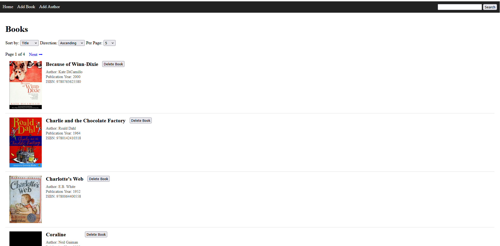

# Library Management System

A lightweight web application built with Flask and SQLAlchemy for managing a library's collection of books and authors. 
The application provides a clean interface for adding, searching, sorting, and deleting records while enforcing data integrity through server-side validation.


## Features

*  Manage books and authors
*  Add new authors with birth and death dates
*  Add books linked to existing authors
*  Search books by title or author name
*  Sort results by title, author, or publication year
*  Paginated book listings
*  Server-side form validation
*  Delete books with automatic cleanup of orphaned authors
*  SQLite database powered by SQLAlchemy ORM
*  Automated cover image through open api search: https://openlibrary.org/dev/docs/api/covers

## Technology Stack

* Python 3
* Flask
* SQLAlchemy
* SQLite
* Jinja2 Templates
* HTML/CSS

## Project Structure

```text
project/
│
├── app.py
├── data_models.py
├── templates/
│   ├── home.html
│   ├── add_author.html
│   └── add_book.html
│
├── data/
│   └── library.sqlite
│
└── requirements.txt
```

## Installation

### 1. Clone the repository

```bash
git clone https://github.com/veragrosskop/BookAlchemy.git
cd BookAlchemy
```

### 2. Create a virtual environment

```bash
python -m venv venv
```

Activate the environment:

**Windows**

```bash
venv\Scripts\activate
```

**macOS / Linux**

```bash
source venv/bin/activate
```

### 3. Install dependencies

```bash
pip install -r requirements.txt
```


### 5. Run the application

```bash
flask run
```

## Validation Rules

### Authors

* Name is required
* Author names must be unique
* Birth date is required
* Death date cannot be earlier than birth date

### Books

* ISBN is required and must contain 13 digits
* Title is required
* Publication year is required
* Books cannot be published before an author's birth
* Books cannot be published after an author's death
* ISBN values must be unique

## Future Improvements

* User authentication and roles
* REST API endpoints
* Book cover uploads
* Advanced filtering options
* Database migrations with Flask-Migrate
* Unit and integration testing
* Docker support

## License

This project is licensed under the MIT License.
